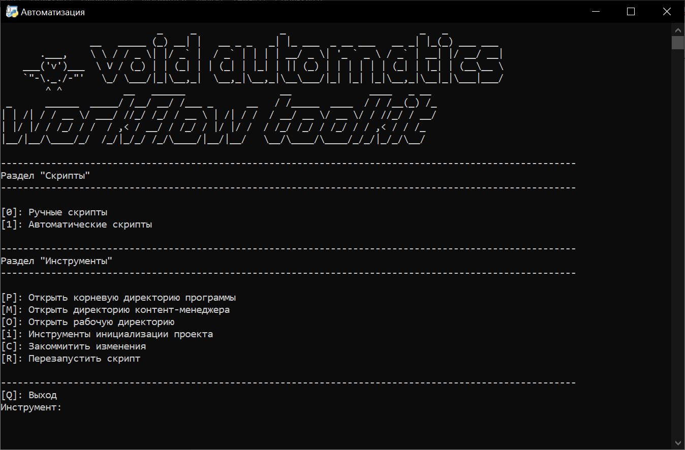

# Workflow-toolkit: Автоматизация рабочего места

### История создания

Данный набор инструментов был создан контент-менеджером предприятия Государственного Бюджетного Профессионального Общеобразовательного Учреждения Республики Крым "Феодосийский Политехнический Техникум" для ускорения работы с контентом.

Создал и поддерживал данный проект Михов Даниил Георгиевич, контент-менеджер с февраля 2024 года.

------

### Набор инструментов 

#### 	Скрипты

##### 			Ручные скрипты

###### 					Выгрузка замен

###### 					Загрузка изображений для новостей

###### 					Форматирование текста для новостей

###### 					Склеивание изображений (вертикально)

###### 					Загрузить изображения/документы на сервер

###### 					Конвертировать Docx/PDF to JPEG/PDF

###### 					Разрезать изображение

###### 					Сконвертировать docx в txt

###### 					Сконвертировать изображение в PDF

###### 					Забэкапить директорию контент-менеджера

###### 					Создать директорию для новости и разместить её в каталоге сегодняшних новостей

##### 			Автоматические скрипты

###### 					Автоматическое преобразование и выгрузка замен

###### 					Автоматическое формирование новостей

#### 	Инструменты

##### 			Инструменты инициализации проекта

###### 					Установить все зависимости

###### 					Создать все необходимые директории

###### 					Очистить пользовательские файлы из директорий

###### 					Создать конфигурационный файл

###### 					Вывести содержимое конфигурационного файла

###### 					Полностью инициализировать проект

##### 			Открыть корневую директорию программы

##### 			Открыть директорию контент-менеджера

##### 			Открыть рабочую директорию

##### 			Закоммитить изменения

##### 			Перезапустить скрипт

# Описание инструментов

### Выгрузка замен

Выгружает файл замен на сервер сайта.

### Загрузка изображений для новостей

Загружает изображения на сервер сайта с дальнейшим формированием таблицы изображений (которую можно поместить дополнительно к макету)

### Форматирование текста для новостей

Форматирует текст для новостей в HTML формате

### Склеивание изображений (вертикально)

Склеивает изображения вертикально (актуально для замен, когда в документе больше одной страницы)

### Загрузить изображения/документы на сервер

Загружает замены/вакансии/другие изображения/документы на сервер сайта.

### Конвертировать Docx/PDF to JPEG/PDF

Позволяет сконвертировать Docx в JPG/PDF и PDF в JPG.

### Разрезать изображение

Разрезает изображение на равные части по вертикали/горизонтали

### Сконвертировать docx в txt

Конвертирует файл Docx в txt

### Сконвертировать изображение в PDF

Конвертирует изображение в JPG.

### Забэкапить директорию контент-менеджера

Создаёт архив содержимого директории контент-менеджера и сохраняет его в папке Backups рабочей директории.

### Создать директорию для новости и разместить её в каталоге сегодняшних новостей

Создаёт во временной папке директорию для вашей будущей новости, просит чтобы вы загрузили в неё контент (файл с текстом новости и картинки, хранящиеся в папке Images). После завершения работы, нажмите Enter для продолжения работы. Скрипт автоматически выгрузит вашу новую папку в директорию сегодняшних новостей (January/01.01 например). Очень удобно использовать со скриптом автоматических формирований новостей. Вы создали папку, загрузили контент, завершили работу, а в это время в папке January/01.01/Ready уже лежит ваша папка с сформированным макетом новости, содержимое которой можно просто скопировать и вставить в админ-панель на сайте. Больше ничего делать не нужно!

### Автоматическое преобразование и выгрузка замен

Запускает скрипт, который автоматически ищет файл замен \*.docx/\*.jpg в рабочей директории. После нахождения спрашивает, тот ли это файл. Если будет указан параметр "Y", скрипт автоматически преобразует docx в jpg и выложит его на сайт. Вам остаётся только загрузить сформированный файл jpg из рабочей директории в группу ВК.

### Автоматическое формирование новостей

Запускает скрипт, который автоматически создаёт папку в директории контент-менеджера с наименованием месяца, в ней с наименованием даты публикации новостей. В последней папке отслеживает новые папки с контентом для новостей. Следуйте структуре папки, чтобы всё работало корректно. После успешной обработки перемещает <Folder Name> в папку Ready. Оттуда необходимо вручную из папки Layout открыть файл макета, скопировать и вставить содержимое в соответствующее поле админ-панели на сайте, предварительно включив опцию "Источник". Автоматически добавятся отформатированный текст (будет необходимость вручную разметить выделения в тексте) и таблица с изображениями. Копируем и вставляем необходимый текст в заголовок статьи и выбираем картинку.

Структура папки:
01.01|
	  <Folder Name>|
	  	   		   Images/
	  	   		   Content.docx

### Установить все зависимости

Устанавливает все зависимости, необходимые для корректной работы приложения.

### Создать все необходимые директории

Создаёт необходимые папки в рабочей директории. 

### Очистить пользовательские файлы из директорий

Очищает все папки в рабочей директории от пользовательского контента.

### Создать конфигурационный файл

Создаёт конфигурационный файл с настройками приложения.

### Вывести содержимое конфигурационного файла

Выводит на экран все параметры конфигурационного файла.

### Полностью инициализировать проект

Автоматически проводит полную инициализацию проекта - устанавливает все зависимости, создаёт все папки в рабочей директории, создаёт конфиг и настраивает его вместе с вами.

### Открыть корневую директорию программы

Открывает корневую директорию программы. Здесь мы можем отследить все файлы, которые участвуют в работе программы.

### Открыть директорию контент-менеджера

Открывает рабочую директорию Контент-менеджера. В ней находятся архивы записей новостей и прочие документы.

### Открыть рабочую директорию

Открывает директорию с папками ConvertDocs, Backups, OtherImages. (По задумке должна выбираться директория Downloads).

### Закоммитить изменения

Используется с помощью Git. Автоматически коммитит все изменения файлов. Удобно при разработке.

### Перезапустить скрипт

Перезапускает весь скрипт. Необходим при возникновении каких-либо ошибок, либо зависании.